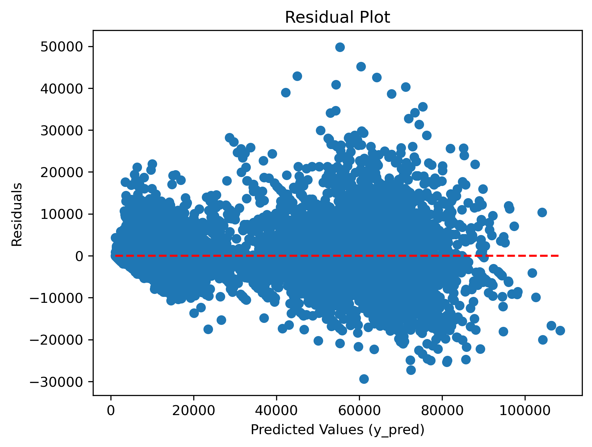
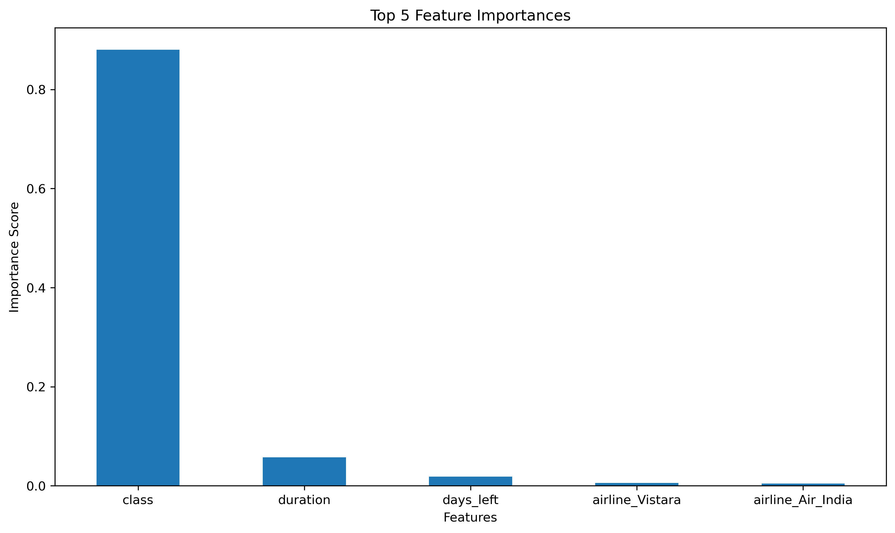
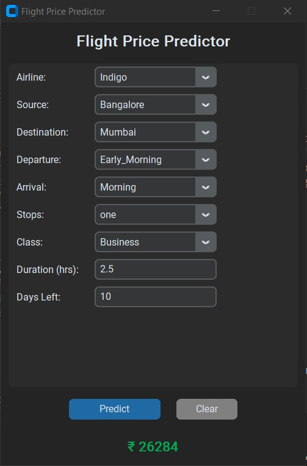

# ✈️ Flight Price Prediction with GUI

This project predicts flight ticket prices using a machine learning model and a graphical user interface. Users can input flight details and receive real-time predictions using a trained and serialized regression model.

## 📌 Introduction

This end-to-end regression project aims to estimate airline ticket prices using flight-related features. A `RandomForestRegressor` is trained on a cleaned dataset, and the resulting model is embedded in a GUI built with `customtkinter` for user-friendly access.

## 🛠 Tools I Used

- **Pandas** – Data handling and transformation  
- **NumPy** – Numerical operations  
- **Scikit-learn** – Data splitting, model training, evaluation, and tuning  
- **Joblib** – Model serialization  
- **Matplotlib** – Data visualization  
- **SciPy** – Randomized parameter distributions for tuning  
- **CustomTkinter** – GUI development

## 🔍 Data Preprocessing

Performed the following preprocessing operations:

- **Column Dropping**: Removed unnecessary columns (`Unnamed: 0`, `flight`)  
- **Binary Encoding**: Converted `class` column to 1 (Business) and 0 (Economy)  
- **Label Encoding**: Factorized the `stops` feature into numeric labels  
- **One-Hot Encoding**: Applied to `airline`, `source_city`, `destination_city`, `arrival_time`, and `departure_time` using `pd.get_dummies()`  
- **Data Integration**: Merged encoded columns back into the main DataFrame and dropped original categorical columns

## 📈 Model Training

Used `RandomForestRegressor` for regression tasks. The model was trained on the processed dataset and initially achieved the following:

- **R² Score**: 0.9855  
- **MAE**: 1,067.16 
- **MSE**: 7,535,179.38  
- **RMSE**: 2,745.03

To assess the model's quality, I visualized the residuals and the most important features:

- 📉 Residual Plot: Shows the distribution of prediction errors  
  

- 📊 Histogram of Residuals: Helps confirm the residuals are normally distributed  
  

- 🌟 Top 5 Feature Importances: Key predictors used by the model  
  

## 🔧 Hyperparameter Tuning

Applied **RandomizedSearchCV** using `scipy.stats.randint` for randomized hyperparameter optimization. After tuning, the updated model performance improved:

- **R² Score**: 0.9866  
- **MAE**: 1,145.39
- **MSE**: 6,927,955.02  
- **RMSE**: 2,632.10

## 🖥 GUI Application

The GUI was developed using `customtkinter`. It allows users to input:

- Airline, source/destination cities, departure/arrival times  
- Number of stops, class type, duration, and days left  

Based on this input, the model returns a flight price prediction instantly.

